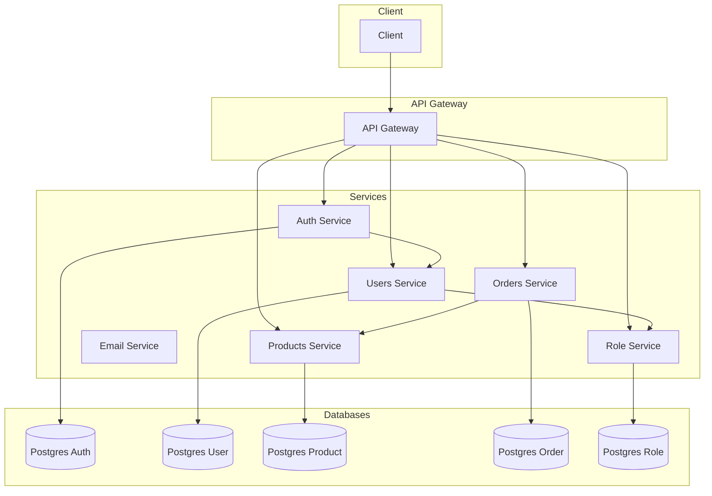

# Simple Microservice E-commerce

This project is a simple e-commerce application built with a microservice architecture using Go.

## Architecture Overview

The application is composed of several microservices that communicate with each other via gRPC. An API Gateway provides a single entry point for clients.



## Getting Started

### Prerequisites

- [Git](https://git-scm.com/)
- [Docker](https://www.docker.com/)
- [Docker Compose](https://docs.docker.com/compose/)

### Installation and Running

1.  **Clone the repository:**

    ```bash
    git clone https://github.com/MamangRust/simple-microservice-ecommerce.git
    cd simple-microservice-ecommerce
    ```

2.  **Run the application with Docker Compose:**

    ```bash
    docker-compose up -d
    ```

This will build the images and run all the services in detached mode.
