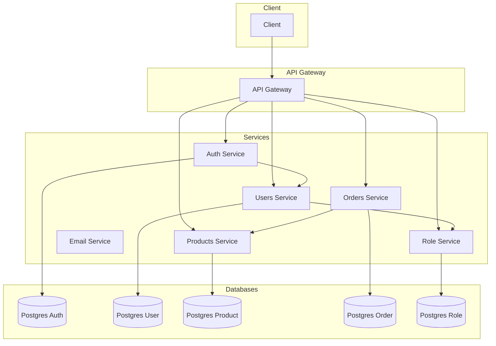

# Simple Microservice E-commerce

A sample e-commerce application built with a microservice architecture in Go. This project demonstrates best practices for building a distributed system, including inter-service communication via gRPC, containerization with Docker, and a comprehensive observability stack.

## Features

- **User Authentication & Authorization:** Secure user registration and login.
- **User, Product, and Order Management:** Core e-commerce functionalities.
- **Role-Based Access Control (RBAC):** Manage user permissions and roles.
- **Asynchronous Communication:** Using Kafka for scalable event-driven architecture.
- **Observability:**
  - **Centralized Logging:** With Loki.
  - **Distributed Tracing:** With Jaeger.
  - **Metrics Monitoring:** With Prometheus and Grafana.

## Architecture

The application is composed of several microservices that communicate with each other via gRPC. An API Gateway provides a single entry point for clients.



## Technology Stack

- **Backend:** Go
- **Communication:** gRPC
- **Database:** PostgreSQL, Redis
- **Message Broker:** Kafka
- **Containerization:** Docker, Docker Compose
- **Observability:** OpenTelemetry, Jaeger, Prometheus, Grafana, Loki

## Getting Started

### Prerequisites

- [Git](https://git-scm.com/)
- [Docker](https://www.docker.com/)
- [Docker Compose](https://docs.docker.com/compose/)

### Installation

1.  **Clone the repository:**

    ```bash
    git clone https://github.com/MamangRust/simphttps://github.com/MamangRust/simple-microservice-ecommerce-go-sqlc.git
    cd simple-microservice-ecommerce-go-sqlc
    ```

2.  **Run the application:**

    ```bash
    docker-compose up -d
    ```

    This command will build the Docker images and start all the services in detached mode.

## Usage

Once the application is running, you can access the following services:

- **API Gateway:** `http://localhost:5000`
- **API Documentation (Swagger):** `http://localhost:5000/swagger/index.html`
- **Grafana (Monitoring):** `http://localhost:3000` (user: `admin`, pass: `admin`)
- **Jaeger (Distributed Tracing):** `http://localhost:16686`
- **Prometheus:** `http://localhost:9090`

## Preview

### Memory and GC Monitoring


### Distributed Tracing with Jaeger


### Centralized Logging with Loki


